# Production Rates Calculator Extreme

## Basic Usage
At its heart Production Rates Calculator Extreme (PRCE) is a rate calculator mod, like many others. Pick the  tool from the shortcut bar or use the keyboard control (default `Alt+X`). This gives you a selection tool to select some buildings.

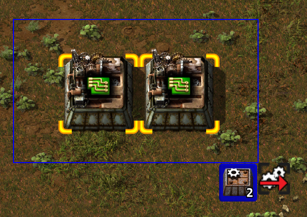

If you do so, you will see the production rates of the selected buildings.
On the left side you can see all products and ingredients. Each section is sorted by type (roughly: power, weird stuff, items, then fluids), then by rate. If rates are very small they might use minutes (`/m`) or hours (`/h`).
On the right side you can see all selected buildings, one line per "identical" building.

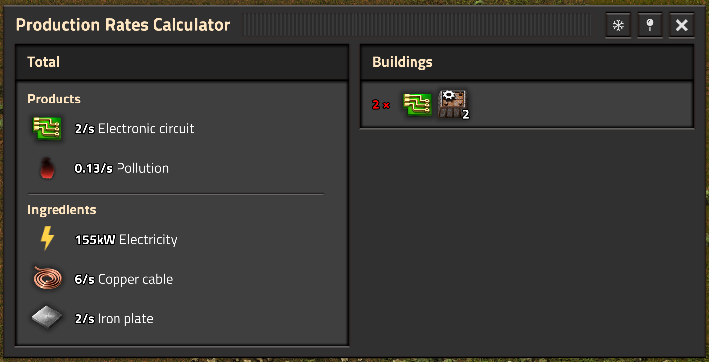

Factorio 2.0 already shows the production rates of a single machine, but if you are interested in more than 1 building you have to do some math in your head, and if you're still waiting for bots to finish building you're out of luck completely.

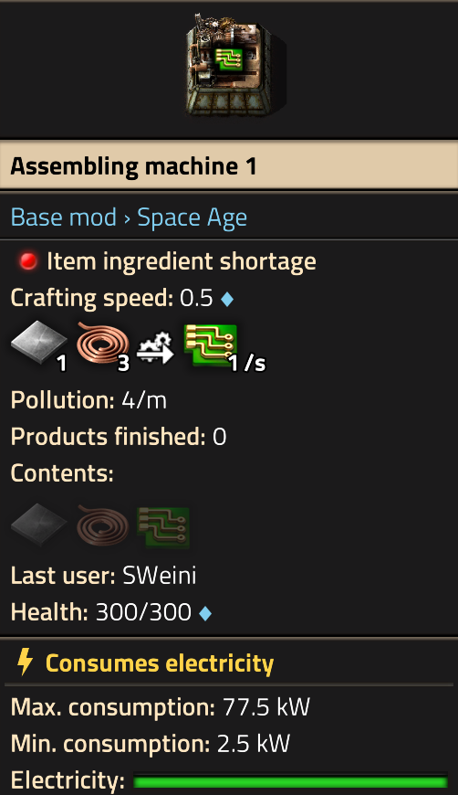

To add to (or remove from) your selected buildings, hold `Shift` and click-drag using the left (or right) mouse button.

Contrary to other mods, PRCE keeps track of the buildings themselves. This means you can't increase building count by adding the same building multiple times. However, you can copy-paste and select those ghost buildings.

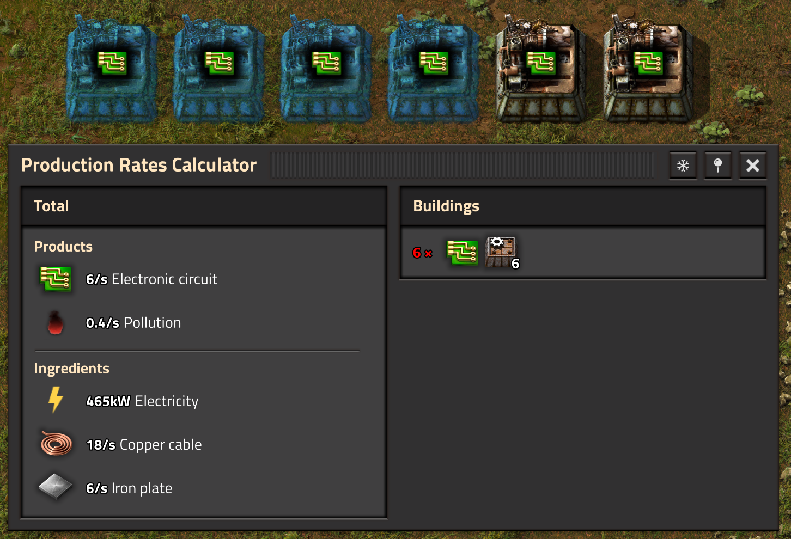

Keeping track of the buildings allows you to make small changes (manually or via undo/redo) and then update everything by `Shift`-selecting an empty area. This is especially useful when selecting buildings from different parts of your base. As an example, here I have upgraded all 6 buildings and then updated PRCE by `Shift`-selecting nothing.

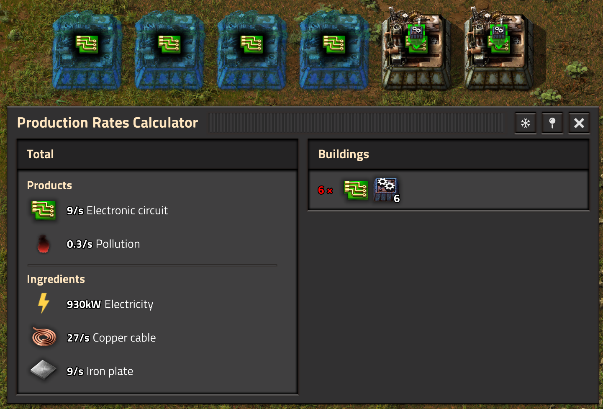

Everything gets a lot more interesting with more than just one building type. Intermediates are things that are produced by some buildings and consumed by others.

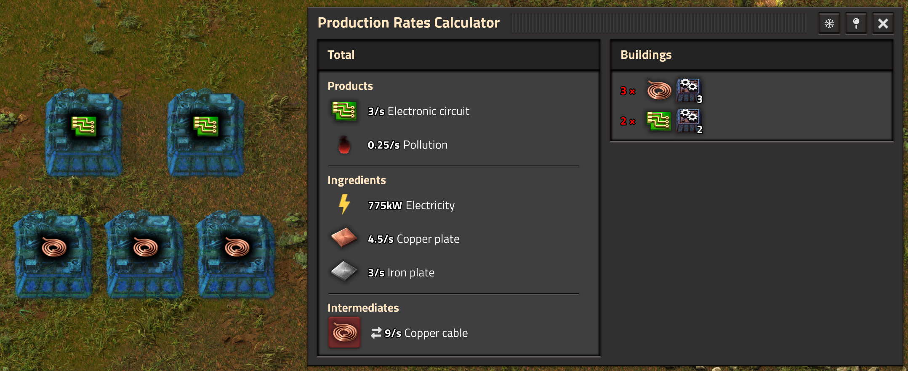

Let's add some modules into the mix! Suddenly the ratio isn't perfect anymore. The right side tells you that there are 3 buildings for copper wire and 2 buildings for electronic circuits, but of the former only 2.78 are actually running (on average). They produce 8.1/s copper cable which is exactly the amount you need for the electronic circuits. If the used building count is white there is still headroom left, if red all the buildings are used - not necessarily a bad thing.

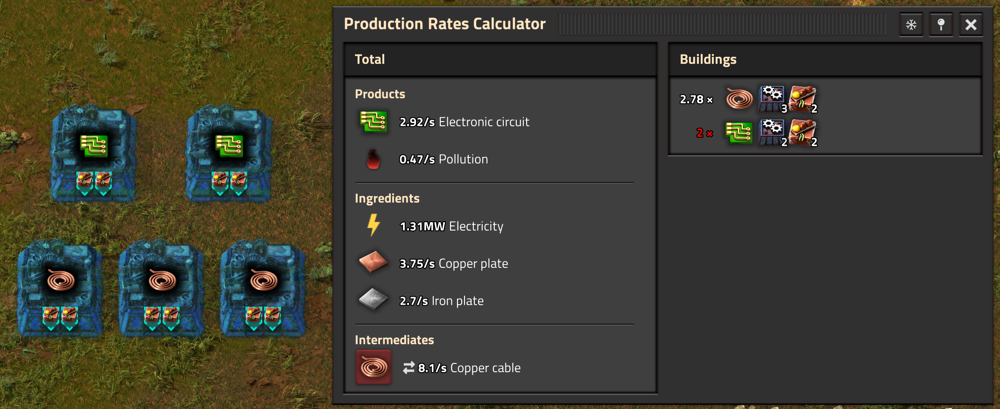

By default, intermediates are automatically balanced (icon is red), but it's possible to not balance (icon is white). Click the icon to change between the two modes. Even if an intermediate is not forced to be balanced it might still be balanced because the rates turned out that way.

Here the copper cables are unbalanced and PRCE tells you that 8.1/s are used internally and another 0.65/s can be exported. These are the numbers that most other mods calculate, but with no way to switch to balanced intermediates.

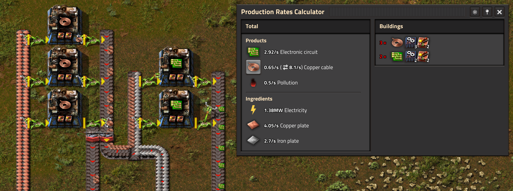

Let's have a closer look at the right side of the window. Every row shows the effective building count (red for 100% utilization), the used recipe, the used building (and the number of buildings), the used modules (and their number per building), and the used beacons with modules (per beacon). If buildings are not exactly the same they go into two different rows. All of these buildings produce copper cables, but they are all different.

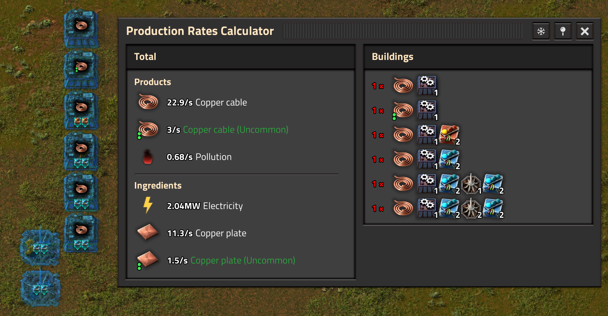

In vanilla factorio the assembling machines are the most important type of building, with furnaces being a close second. Especially in early game you are building furnace stacks to smelt your ores into plates.

Who knows what those two (small) furnace stacks produce?

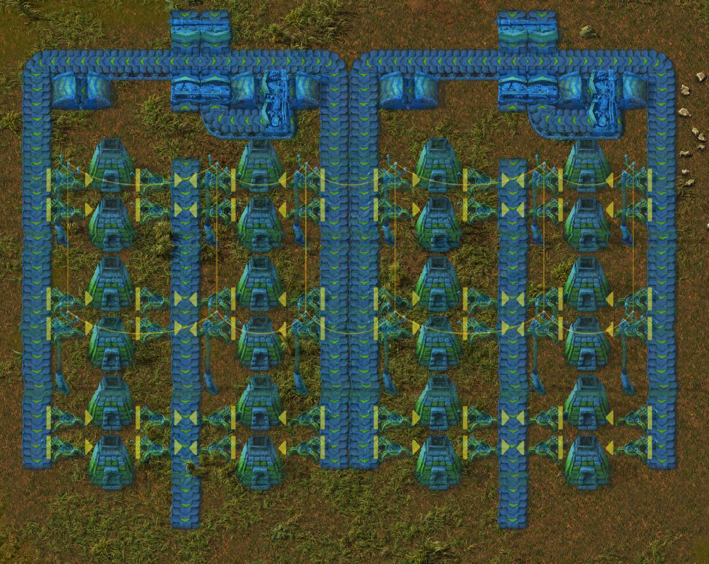

That was a trick question, no one knows, not even PRCE. However, you can connect the belts properly and PRCE can figure it out.
Here the left furnace stack is smelting iron ore into plates, the filtered inserter was enough to indicate that (you have to select the inserter though). The right furnace stack is connected to at least one mining drill on the stone patch.

PRCE does not analyze belt throughput and connectivity, it is "only" determining the set of items that can sit on any given piece of belt, moved by an inserter or loader, filtered by a splitter, ...

For example, 8 of the 10 mining drills are not connected, and PRCE still shows the ratio as if all stone from mining drills will reach the stone furnaces. You still have to design a proper build, with full connectivity and enough throughput on belts/inserters. PRCE is a rate calculator, and the item detection exists to help with furnace ghosts.

This system isn't perfect yet, e.g. some building types are missing and spoilage is not respected. One well-placed inserter with a filter should be enough to select the recipe and calculate ratios.

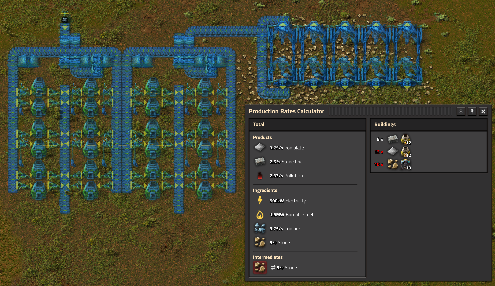

By the way, the above example shows some weird ingredients: burnable fuel and stone.

The burnable fuel is the fuel category accepted by the stone furnace. If you want to use coal you can set a filter on the fuel inventory. There is no item detection for fuels to minimize the performance-heavy belt tracing.

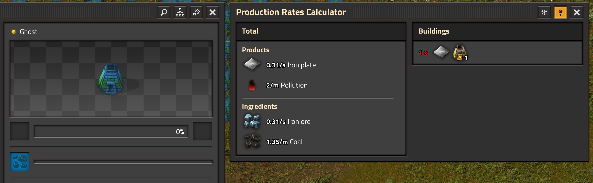

The stone is not the __item__ stone, it is the __resource__ stone on the map. Productivity modules, mining productivity research and better mining drills with better (less) resource drain all influence this value. This is one mighty mining drill!

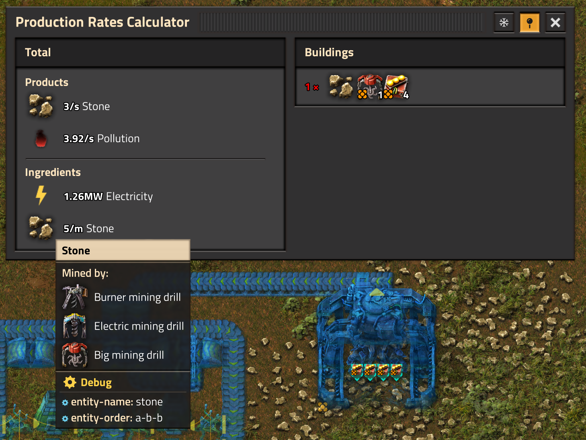

Sometimes the fluid (and their temperatures) are important. In those cases PRCE will follow the pipes if you connect them. If you don't, PRCE will shout in your face. In this instance it doesn't matter because the defaults were correct.

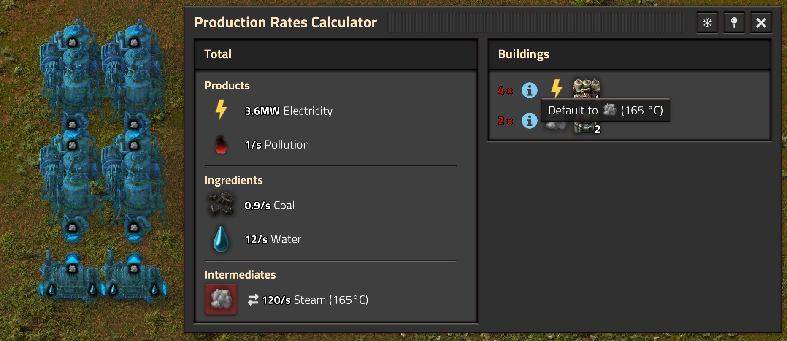

Two fluids of different temperature are different things. They don't interact and you won't get the results you want. Connecting the pipes does help. By the way, the water temperature does matter, but you normally don't create water with a temperature different from the default. Play overhaul mods and this might change. Connect the water pipes properly and that warning will also go away.

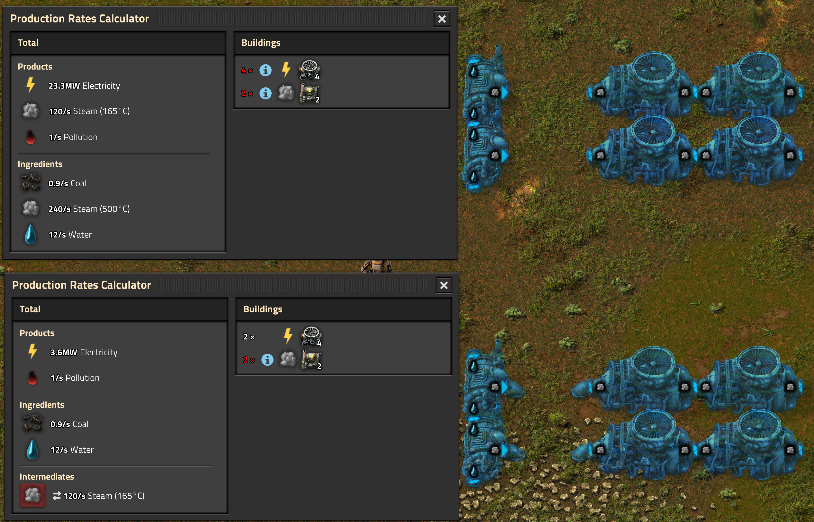

Many buildings "just work". For example, here is my very first spaceship I built and the initial rates in PRCE.

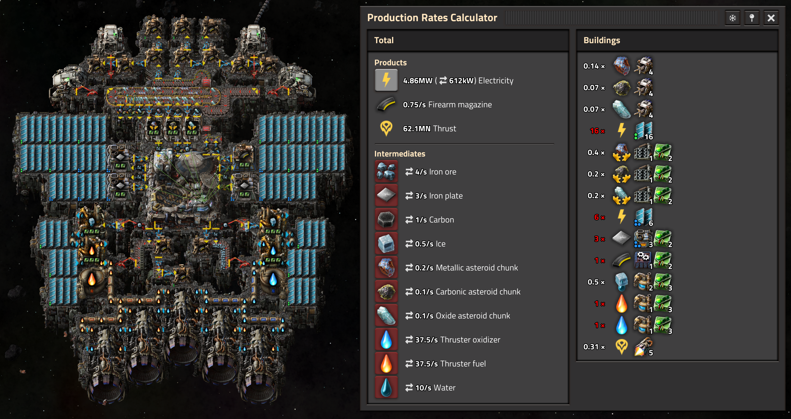

A few notes about that:
- Electricity is not linked by default. If you have power-producing buildings, you are often interested in the surplus of energy.
- The calculated thrust is using the thrusters' efficiency profile.
- Solar panels use the solar power of Nauvis orbit (where this ship is currently sitting).
- I didn't filter the asteroid collectors, and so all 4 appear multiple times. (Some would happen if you feed a sushi belt into a recycler).
- Rates of asteroid collectors are just a good guess, and they assume that there are always asteroid chunks to grab. Definitely build more than what PRCE thinks is a perfect ratio.

## Under The Hood

Sometimes it helps to understand how something works under the hood. With this knowledge and some thinking you might be able to figure out for yourself why some edge cases are not 100% as expected.

Here is how PRCE roughly works:

### Selection

You select specific buildings, and they stay selected. If you `Ctrl+X`,`Ctrl+V` them, they become different buildings. If you upgrade, downgrade, rotate, flip, change recipe, build them, they stay the same building.

### Detect Items and Fluids

This is a multi-step process. First, starting from all buildings that need detection, the source of items/fluids is traced back to its source. This follows pipes/belts/inserters, respects filters, and stops when it finds a definitive source. The output if this first step is a graph of how items/fluids move. Second, all definitive sources produce their items and fluids, and then those move forward in the graph. When a building with dynamic output (such as a furnace) is reached, it might put more items/fluids into the system. This continues until there are no more changes.

This is a quite involved step, and it covers a lot of edge cases (probably not all of them). Here are a few:
- Two separate belt lanes
- Sideloading into (underground) belts
- Splitter and filtered splitter
- Inserters and filtered inserters (even moving items from chest to chest or on the ground)
- Lane splitter (mod-only)
- Loaders (mod-only)
- Linked belts (mod-only)
- Infinity chests might be a source of items
- Item filters can be whitelist/blacklist
- Item filters can be a specific item/quality combination, or a specific item with quality filter or just a quality filter
- Pipes and underground pipes
- Pumps and filtered pumps
- Valves (mod-only)
- Linked pipes (mod-only)
- Infinity pipes might be a source of fluids

Not covered right now are:
- Spoilage
- Items sent to orbit in rocket silo
- Many other building types, so far I mostly started with assembling machines and furnaces
- Detection of item fuels (for performance reasons and because there are fuel inventory filters)

### Configurations

Every building is converted into a "configuration". This uses all the information available from the building itself, its surrounding beacons and the items/fluids detected in the previous step. One such configuration might be "Assembling machine 2 with copper wire recipe, 2 productivity modules 1, 2 beacons with 2 speed modules 1 each".

Then all buildings are grouped into identical configurations. Each of those groups becomes one row on the right side of the GUI.

### Rate Calculation

Every configuration has a fixed ratio of inputs and outputs. Calculating this should be straight forward, all the data is already there. However, there are a few challenges:
- Rounding of module effects (they are rounded, aggregated and clamped in a certain way by the engine)
- Buildings that can't run at 100% speed due to not having enough power
- Rocket silo launch animation (haven't done that yet)
- Thrusters don't have a fixed ratio due to their efficiency profile
- When a spaceship is moving their solar energy changes every second

### Balancing

PRCE calculates the used building numbers by optimizing a mathematical problem, that is defined by the production rates of each configuration with some further constraints:
- A configuration can't be running on a negative number of building
- A configuration can't be running on more buildings than were selected
- Each balanced intermediate must be balanced (sum of production equals zero - consumption counts negative)
- Non-balanced intermediates or pure products/ingredients don't appear at all

If you've used any tool for planning your factory you might miss the first step: Telling what to optimize for. In a planning tool the user might define the goal "produce 5/s electronic circuits". This will become another constraint, similar to a balanced intermediate (sum equals 5/s). The goal is to minimize the "cost" (e.g. total number of used buildings).

In PRCE you never defined your production goal. Instead the goal is to maximize the number of used buildings. In most cases this leads to the expected result. When your selection has multiple near-identical buildings, PRCE will prefer the worst building, which might be unintuitive at first sight. Also, if you have barrel/unbarrel loops just for fun, PRCE will gladly use all those useless buildings.
